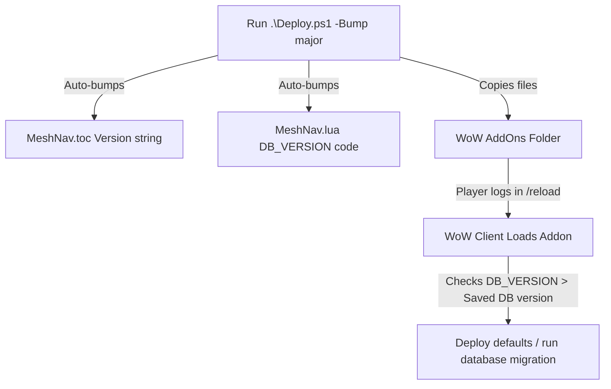

# Deployment and Versioning Protocols

This document outlines the protocols for pushing updates to your local WoW client and managing database migrations when rolling out major release updates.

---

## 1. Overview of the Deployment Framework

The deployment framework is designed to automate two distinct phases of rolling out a release:
1. **The Packaging & Local Copying Phase**: Moving addon files into your World of Warcraft client (`Interface/AddOns/MeshNav`).
2. **The Database Upgrade Phase**: Ensuring that when a player loads the new version, the Lua client detects a version change and automatically deploys new default configurations to their `SavedVariables` profile (similar to the ItemRack `EventsVersion` check protocol).



---

## 2. Local Client Deployment Protocol (`Deploy.ps1`)

To test the addon locally, you can deploy updates to your client by running the [Deploy.ps1](file:///c:/Dev%20Projects/MeshLPS/Deploy.ps1) script from PowerShell.

### Step 1: Open PowerShell and set the execution policy
Before running the deployment script, ensure your execution policy allows the script to run in the current process:
```powershell
Set-ExecutionPolicy RemoteSigned -Scope Process
```

### Step 2: Run the deployment script
You can run the script with a `-Bump` parameter to automatically update the version in both `MeshNav.toc` and `MeshNav.lua`:

*   **For patches (e.g., bug fixes)**:
    ```powershell
    .\Deploy.ps1 -Bump patch
    ```
*   **For minor releases (e.g., adding features)**:
    ```powershell
    .\Deploy.ps1 -Bump minor
    ```
*   **For major releases (e.g., breaking changes or database structural updates)**:
    ```powershell
    .\Deploy.ps1 -Bump major
    ```

### How the Script Works
- **Path Auto-Location**: The script scans standard Windows directories for a World of Warcraft `_classic_` installation. If found, it saves this path in a local `DeployConfig.json` file for future uses. If not found, it prompts you for the path.
- **TOC Bumping**: It parses and updates `## Version: X.Y.Z` in [MeshNav.toc](file:///c:/Dev%20Projects/MeshLPS/MeshNav/MeshNav.toc).
- **Lua Bumping**: It converts `X.Y.Z` into a clean numerical representation (e.g. `1.0.0` becomes `10000`) and replaces `local DB_VERSION = <num>` in [MeshNav.lua](file:///c:/Dev%20Projects/MeshLPS/MeshNav/MeshNav.lua).
- **Copying**: It copies the entire `MeshNav/` directory to the WoW AddOns folder.

---

## 3. In-Game Database Deployment Protocol

To prevent SavedVariables from breaking when structural changes occur, [MeshNav.lua](file:///c:/Dev%20Projects/MeshLPS/MeshNav/MeshNav.lua) employs an automatic migration checker on load:

1. **DB_VERSION Identifier**: The Lua file declares a constant representing the build version:
   ```lua
   local DB_VERSION = 10000 -- (Major * 10000 + Minor * 100 + Patch)
   ```
2. **Upgrade Trigger**: In the `ADDON_LOADED` event handler, the code compares the saved database version (`MeshNavDB.version`) to `DB_VERSION`:
   ```lua
   local dbVer = MeshNavDB.version or 0
   if dbVer < DB_VERSION then
       print("|cff00ff00MeshNav Database Deploy:|r Updating database from version " .. dbVer .. " to " .. DB_VERSION)
       -- Force or apply new default values
       MeshNavDB.version = DB_VERSION
       MeshNavDB.item30 = 21519
       MeshNavDB.item40 = 9062
   end
   ```
3. **Outcome**: When you reload the UI after a major deploy, your chat frame will notify you that the database was successfully updated, ensuring settings remain stable.

